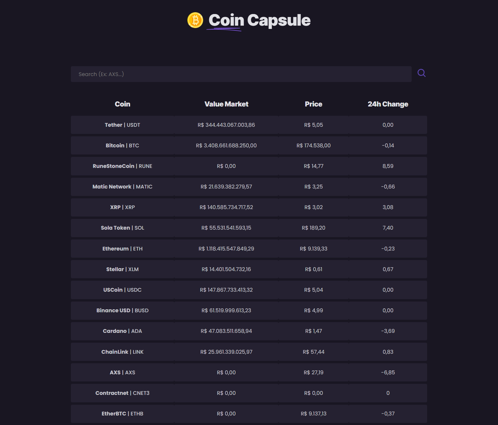
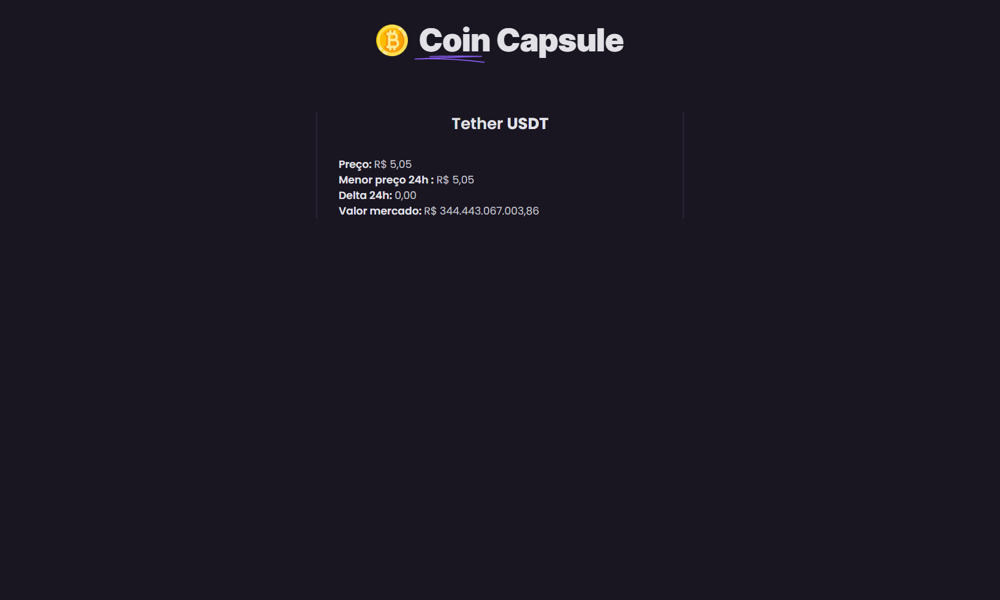
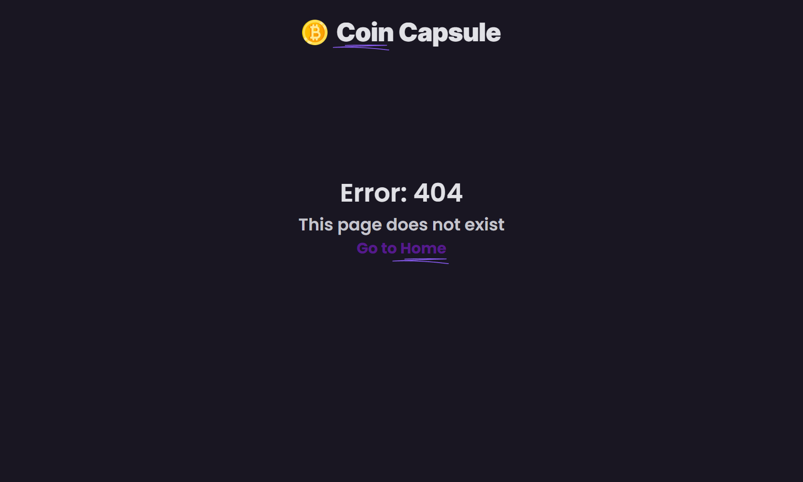

<h2>Coin Capsule</h2>

👉 Live Demo: <a href='https://coin-capsule.vercel.app'>Live Demo</a>

<h3>🔧 Tools:</h3>

» React JS  
» TypeScript  
» Axios  
» Styled components  
» React router-dom  
» React icons

<h2>Screenshots of the Project 📸</h2>
 
<h3 align='center'>Home Page 🏡</h3>

